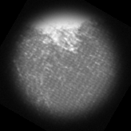
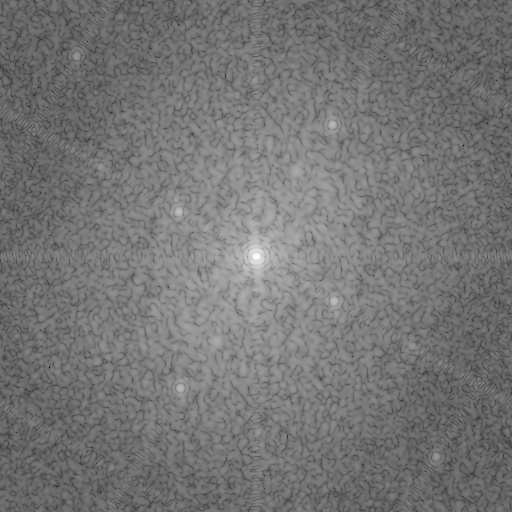
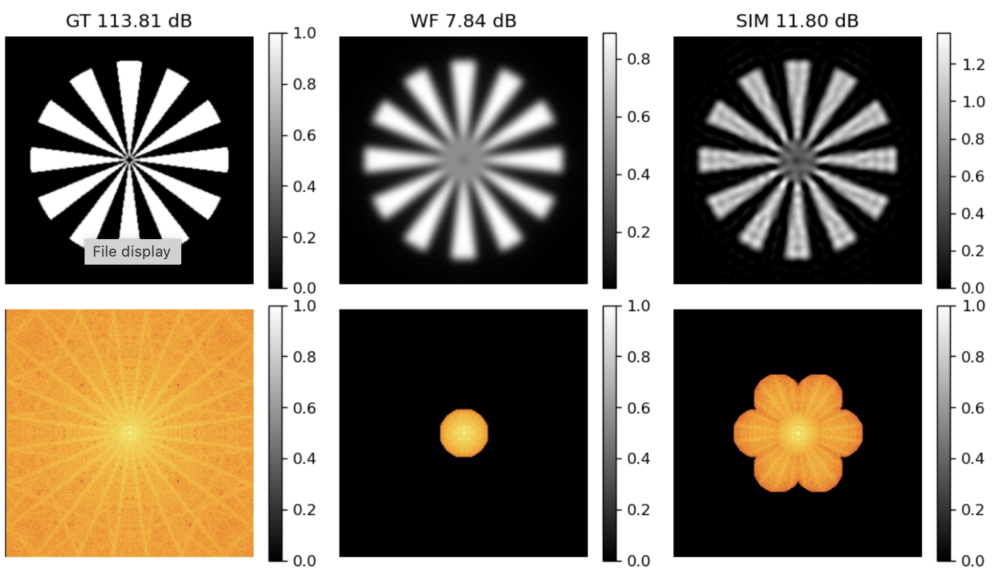

># Lecture Companion Notebooks

## Introduction to Multidimensional Fourier Transform
*Daniel Sage — École Polytechnique Fédérale de Lausanne (EPFL)*

This repository contains a set of Jupyter notebooks designed as a direct complement to a lecture on Fourier image processing. The notebooks focus on visual intuition, frequency-domain reasoning with many illustrations.

## Run it in a browser using Jupyter-Lite

[Open **3_Fourier_Properties.ipynb** in JupyterLite](https://dasv74.github.io/fourier-companion-lecture-jupyterlite/lab/index.html?path=3_Fourier_Properties.ipynb)

## Scope

- Fourier decomposition of images, Fourier-based reconstruction and demonstrations of Fourier properties
- Convolution and deconvolution in the frequency domain
- Experiment basic Super-Resolution SIM Reconstruction (Structured Illumination Microscopy) 

## Intended use

- Lecture companion material for in-class demonstrations
- Practical sessions for revision
  
These notebooks are not meant to replace a theoretical lecture, but to make abstract Fourier concepts concrete and visually intuitive.

## Requirements
- Python ≥ 3.9
- numpy
- scikit-image
- matplotlib
- ipywidgets
- notebooks

All notebooks run in a standard Jupyter environment.

# JupyterLite Fourier

JupyterLite deployed as a static site to GitHub Pages, for demo purposes.

## ✨ Try it in your browser ✨

➡️ **https://jupyterlite.github.io/demo**

## Requirements

JupyterLite is being tested against modern web browsers:

- Firefox 90+
- Chromium 89+

## Deploy your JupyterLite website on GitHub Pages

Check out the guide on the JupyterLite documentation: https://jupyterlite.readthedocs.io/en/latest/quickstart/deploy.html

## Further Information and Updates

For more info, keep an eye on the JupyterLite documentation:

- How-to Guides: https://jupyterlite.readthedocs.io/en/latest/howto/index.html
- Reference: https://jupyterlite.readthedocs.io/en/latest/reference/index.html

This template provides the Pyodide kernel (`jupyterlite-pyodide-kernel`), the JavaScript kernel (`jupyterlite-javascript-kernel`), and the p5 kernel (`jupyterlite-p5-kernel`), along with other
optional utilities and extensions to make the JupyterLite experience more enjoyable. See the
[`requirements.txt` file](requirements.txt) for a list of all the dependencies provided.

For a template based on the Xeus kernel, see the [`jupyterlite/xeus-python-demo` repository](https://github.com/jupyterlite/xeus-python-demo)

